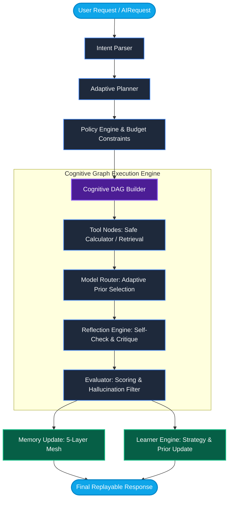

<div align="center">

<p align="center">
  
</p>

# 🧠 MindLatticeAI

### *Adaptive AI Orchestration Framework with Execution-History Learning & Cognitive DAGs*

[](https://www.python.org/)
[](https://opensource.org/licenses/MIT)
[](tests/)
[](docs/architecture.md)
[](https://github.com/raitulh/MindLatticeAI)
[](https://github.com/raitulh/MindLatticeAI/stargazers)

<br/>

[**Explore Architecture**](docs/architecture.md) •
[**Quickstart**](#-quickstart) •
[**Core Innovations**](#-core-innovations) •
[**Live Providers**](#-multi-provider-support) •
[**Framework Comparison**](#-why-mindlatticeai) •
[**Roadmap**](docs/roadmap.md)

</div>

---

## 🌟 Overview

**MindLatticeAI** is a research-oriented, adaptive AI orchestration framework designed around a fundamental premise:

> **Every AI request is an experiment.** 
> An autonomous agent must formulate a strategy, compile a resilient execution graph, evaluate its own intermediate reasoning, mutate its prompt genomes, learn from execution telemetry, and store experiential knowledge across multi-layer memory meshes.

This repository is intentionally **not** a LangChain clone, a CrewAI-style static conversational crew, or a simple LiteLLM router. Its core abstraction is an **Execution-History Learning Loop** operating over **Cognitive Directed Acyclic Graphs (DAGs)** with **checkpointed node resilience** and **evolvable prompt genomes**.

---

## ⚡ Terminal Execution Preview

```ansi
[MindLatticeAI Runtime] Initializing Request: "Calculate 21 * 2 and reflect on strategy"
├── [1. INTENT]      Task: TOOL_AUGMENTED_REASONING | Tools Required: ['calculator'] | Risk: NORMAL
├── [2. PLANNER]     Compiled Strategy: strategy_da4539 | Genome: genome.default.cognitive (gen 0)
├── [3. POLICY]      Budget: Max $0.25 | Latency: 15,000ms | Checks Passed (ALLOWED)
├── [4. DAG ENGINE]  Executing Cognitive Graph (7 Nodes):
│   ├── [RUN]        tool.calculator       ───► SUCCEEDED (42.0) [1ms]
│   ├── [RUN]        model.main            ───► SUCCEEDED (routed: local:heuristic-v1) [2ms]
│   ├── [RUN]        reflect.self_check    ───► SUCCEEDED (critique: grounded) [1ms]
│   ├── [RUN]        evaluate.score        ───► SUCCEEDED (quality: 0.932, hallucination: 0.05)
│   ├── [PARALLEL]   memory.write & learn.update ───► SUCCEEDED [checkpointed]
│   └── [FINALIZE]   final.response        ───► READY
└── [5. LEARNER]     Feedback Prior Updated: Prior 0.85 ──► 0.932 | Genome Fitness: +0.082
```

---

## 🔬 Why MindLatticeAI?

Traditional agent frameworks rely on static, brittle chains or fixed multi-agent chat loops. MindLatticeAI pioneers an **adaptive, closed-loop execution paradigm**:

| Feature / Dimension | LangChain / LlamaIndex | CrewAI / AutoGen | LiteLLM | 🧠 **MindLatticeAI** |
| :--- | :--- | :--- | :--- | :--- |
| **Execution Topology** | Static Chains / Agents | Conversational Chat Loops | Flat Provider Routing | **Dynamic Cognitive DAGs** with node checkpoints & retries |
| **Prompt Engineering** | Static template strings | Role descriptions | Passthrough | **Evolvable Prompt Genomes** with scoring & mutation |
| **Adaptation Mechanism** | None (Deterministic) | Prompt engineering | Heuristic failover | **Continuous Learning Loop** updating model & strategy priors |
| **Memory Architecture** | Buffer / Vector Index | Chat history buffer | None | **5-Layer Memory Mesh** (Short, Long, Semantic, Episodic, Graph) |
| **Self-Correction** | Ad-hoc retry | Conversational critique | None | **Dedicated Reflection & Hallucination Evaluator** |
| **Local-First Capability** | Needs external APIs | Needs external APIs | Needs external APIs | **100% Zero-Dependency Offline-First** with live API contracts |

---

## 🏗️ Architecture & Cognitive Loop

Every user query triggers an adaptive cognitive cycle:



---

## 🧬 Core Innovations

### 1. 🕸️ Cognitive Execution Graphs (DAG Engine)
- Requests are compiled into directed acyclic graphs containing atomic, inspectable nodes (`TOOL_CALL`, `MODEL_CALL`, `REFLECTION`, `EVALUATION`, `MEMORY_WRITE`, `LEARNING`).
- Independent nodes execute concurrently in non-blocking event loops.
- **Node-level checkpoints** enable pause, resume, and automated retries on transient network faults.
- Native export to Graphviz DOT format for instant visualization of execution pathways.

### 2. 🧬 Evolvable Prompt Genomes
Prompts are not static strings—they are structured genomes containing:
- **Identity & Instructions:** Role definitions, instruction sets, and dynamic constraints.
- **Self-Evaluation Criteria:** Groundedness checks, uncertainty estimations, and safety bounds.
- **Generational Evolution:** When an execution receives low evaluation scores, the registry mutates the genome, generating improved offspring with updated instructions and tracked parentage.

### 3. 🔄 Closed-Loop Feedback & Learning Engine
- Tracks execution metrics across every interaction: latency, financial cost, quality score, and hallucination probability.
- Automatically adjusts:
  - **Strategy preference scores**
  - **Prompt genome fitness priors**
  - **Model routing weightings**
  - **Memory retrieval importance biases**

### 4. 🧠 5-Layer Memory Mesh
- **Short-Term Memory:** Working session context with automated sliding-window compression.
- **Long-Term Memory:** Summarized durable memory across past interactions.
- **Semantic Memory:** Content-based similarity retrieval using vectorized lexical signatures.
- **Episodic Memory:** Chronological historical traces of previous graph trajectories.
- **Knowledge Graph:** Triple-based relational store (`(Entity, Relation, Entity)`) with deduplication.

---

## 🚀 Quickstart

### Installation

Clone the repository and install in editable mode:

```bash
git clone https://github.com/raitulh/MindLatticeAI.git
cd MindLatticeAI
python -m pip install -e .
```

### 1. Basic Synchronous Execution

MindLatticeAI runs **100% offline out-of-the-box** using deterministic local heuristic providers:

```python
from mindlatticeai import Agent

# Initialize default agent
agent = Agent()

# Execute request
response = agent.run("Calculate 21 * 2 and explain why DAG execution improves AI reliability.")

print("Response:\n", response.text)
print("\nMetrics:", response.metrics)
print("\nReplay ID:", response.replay_id)
```

### 2. Asynchronous Execution with Custom Budget

```python
import asyncio
from mindlatticeai import Agent
from mindlatticeai.schemas import AIRequest, RuntimeBudget

async def main():
    agent = Agent()
    request = AIRequest(
        input="Provide a structured overview of cognitive computing.",
        budget=RuntimeBudget(
            max_cost_usd=0.10,
            latency_budget_ms=3000,
            quality_floor=0.80
        )
    )
    
    response = await agent.arun(request)
    print(response.text)

asyncio.run(main())
```

---

## 🌐 Multi-Provider Support

MindLatticeAI includes built-in, zero-dependency HTTP completion support for all major LLM backends. Simply export your API key:

```python
import os
from mindlatticeai import Agent
from mindlatticeai.providers import (
    GeminiProvider,
    OpenAIProvider,
    ClaudeProvider,
    DeepSeekProvider,
    OllamaProvider,
)

# Set keys
os.environ["GEMINI_API_KEY"] = "your-gemini-key"
# os.environ["OPENAI_API_KEY"] = "your-openai-key"
# os.environ["ANTHROPIC_API_KEY"] = "your-anthropic-key"
# os.environ["DEEPSEEK_API_KEY"] = "your-deepseek-key"

agent = Agent(
    providers=[
        GeminiProvider(model="gemini-1.5-pro"),
        OpenAIProvider(model="gpt-4.1-mini"),
        ClaudeProvider(model="claude-3-5-sonnet"),
        DeepSeekProvider(model="deepseek-chat"),
        OllamaProvider(model="llama3.1"),
    ]
)

response = agent.run("Explain how adaptive prior routing works.")
print(response.text)
```

---

## 🛠️ Extending MindLatticeAI

<details>
<summary><b>1. Custom Tool Registration</b></summary>

```python
from mindlatticeai import Agent
from mindlatticeai.tools import Tool, ToolRegistry

def reverse_string(text: str) -> str:
    return text[::-1]

tools = ToolRegistry()
tools.register(
    Tool(
        name="string_reverser",
        description="Reverses any input string",
        handler=reverse_string,
    )
)

agent = Agent(tools=tools)
```
</details>

<details>
<summary><b>2. Lifecycle Plugins & Hooks</b></summary>

```python
from mindlatticeai import Agent
from mindlatticeai.plugins import PluginManager

plugins = PluginManager()

@plugins.hook("after_plan")
def log_plan(strategy):
    print(f"Strategy formulated: {strategy.id} with {len(strategy.steps)} steps")

@plugins.hook("after_learn")
def log_learning(score):
    print(f"Learning feedback registered: Quality Score = {score:.4f}")

agent = Agent(plugins=plugins)
```
</details>

<details>
<summary><b>3. Automated Benchmarking</b></summary>

```python
import asyncio
from mindlatticeai import Agent
from mindlatticeai.benchmarks import BenchmarkCase, BenchmarkSuite

async def run_eval():
    agent = Agent()
    suite = BenchmarkSuite([
        BenchmarkCase(name="math", input="Calculate 15 * 3", expected_keywords=["45.0"]),
        BenchmarkCase(name="concept", input="What is a DAG?", expected_keywords=["directed"]),
    ])
    
    report = await suite.arun(agent)
    print(f"Success Rate: {report.success_rate * 100:.1f}%")
    print(f"Mean Latency: {report.mean_latency_ms:.2f}ms")

asyncio.run(run_eval())
```
</details>

---

## 📂 Project Architecture

```text
mindlatticeai/
├── src/mindlatticeai/
│   ├── core/          # Agent facade & RuntimeConfig
│   ├── graph/         # DAG builder, concurrent execution engine, checkpoints
│   ├── planner/       # Intent parsing & adaptive strategy synthesis
│   ├── policy/        # Dynamic runtime policies & budget governors
│   ├── prompts/       # Prompt Genome registry, scoring, & mutation
│   ├── router/        # Multi-factor model router (latency, cost, prior)
│   ├── learner/       # Continuous learning loop & prior updater
│   ├── memory/        # 5-layer memory mesh (short, long, semantic, episodic, graph)
│   ├── providers/     # Local heuristic & live API providers (OpenAI, Gemini, etc.)
│   ├── reflection/    # Self-reflection critique & hallucination evaluator
│   ├── tools/         # Built-in safe tools & extensible registry
│   ├── cache/         # Exact & semantic similarity caches
│   ├── replay/        # Execution replay & snapshot serialization
│   ├── telemetry/     # Tracing, latency metrics, & DOT visualization
│   ├── benchmarks/    # Evaluation suite primitives
│   └── security/      # Sandboxing & security policies
├── tests/             # 18 Unit & Integration test suites
├── examples/          # Executable end-to-end usage examples
└── docs/              # In-depth architectural specifications & roadmap
```

---

## 🧪 Testing & Quality Assurance

MindLatticeAI comes with comprehensive test suites covering all architectural layers:

```bash
# Run complete test suite
pytest -v

# Run with test coverage
pytest --cov=mindlatticeai
```

---

## 🗺️ Roadmap & Research Directions

- [x] DAG Execution Engine with atomic checkpoints & retries
- [x] Evolvable Prompt Genomes with generational mutations
- [x] 5-Layer Multi-Layer Memory Mesh
- [x] Zero-dependency HTTP providers for OpenAI, Gemini, Claude, Ollama, DeepSeek
- [ ] Contextual Bandit reinforcement learning for model routing
- [ ] Vector database backend adapter (Qdrant, Chroma, Milvus)
- [ ] Distributed DAG workers via Redis / Celery
- [ ] Web dashboard for real-time trace, cost, and graph replay analysis

See the full [Roadmap Document](docs/roadmap.md) for details.

---

## 🤝 Contributing

Contributions from the AI research and engineering community are warmly welcome! Whether it's novel graph mutation algorithms, new providers, memory backends, or benchmark datasets:

1. Fork the Project
2. Create your Feature Branch (`git checkout -b feature/CognitiveFeature`)
3. Commit your Changes (`git commit -m 'Add CognitiveFeature'`)
4. Push to the Branch (`git push origin feature/CognitiveFeature`)
5. Open a Pull Request

---

## 📄 License

Distributed under the **MIT License**. See [`LICENSE`](LICENSE) for more details.

---

## ✍️ Citation

If you use **MindLatticeAI** in your academic research or production systems, please cite:

```bibtex
@software{mindlatticeai2026,
  author = {Raitul Hasan Priyo and Contributors},
  title = {MindLatticeAI: Adaptive AI Orchestration Framework with Execution-History Learning and Cognitive Graphs},
  url = {https://github.com/raitulh/MindLatticeAI},
  year = {2026}
}
```

<div align="center">
  <sub>Built with ❤️ by <a href="https://github.com/raitulh">Raitul Hasan Priyo</a> and the MindLatticeAI community.</sub>
</div>
